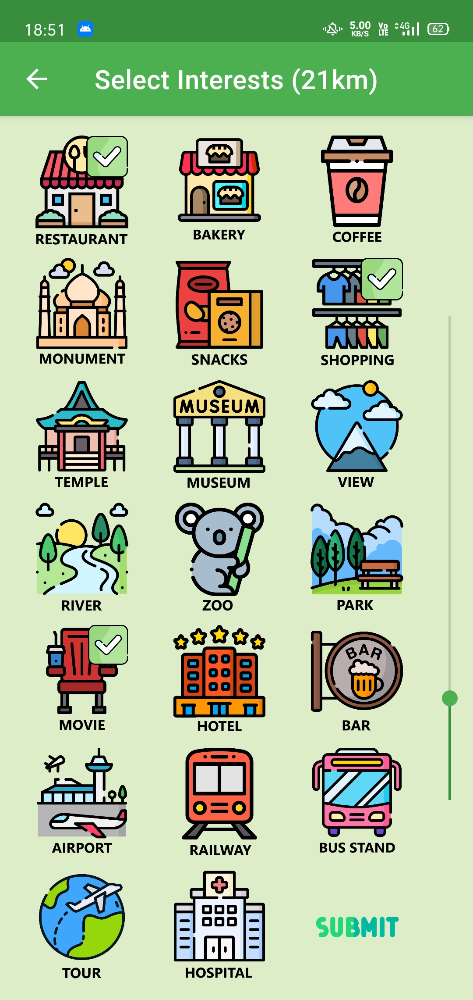
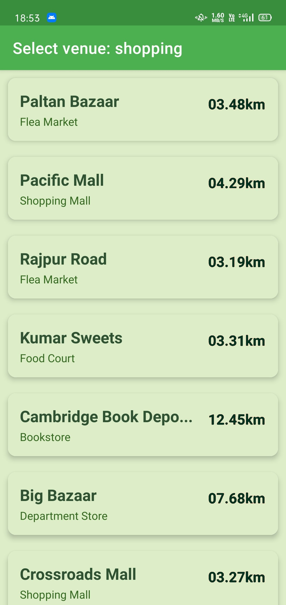
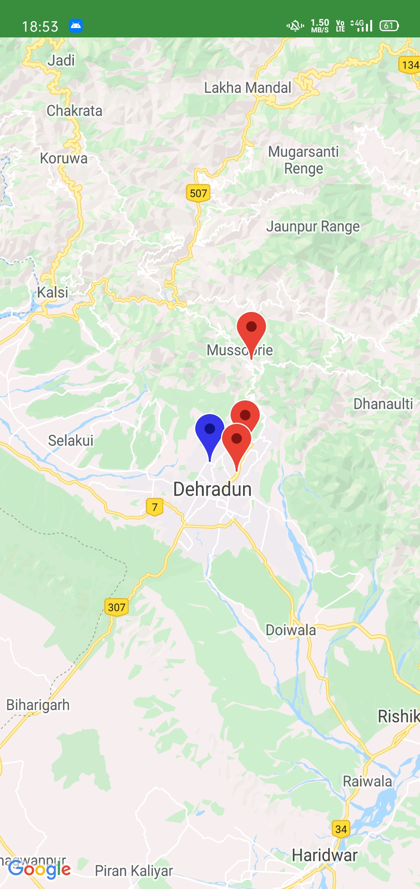
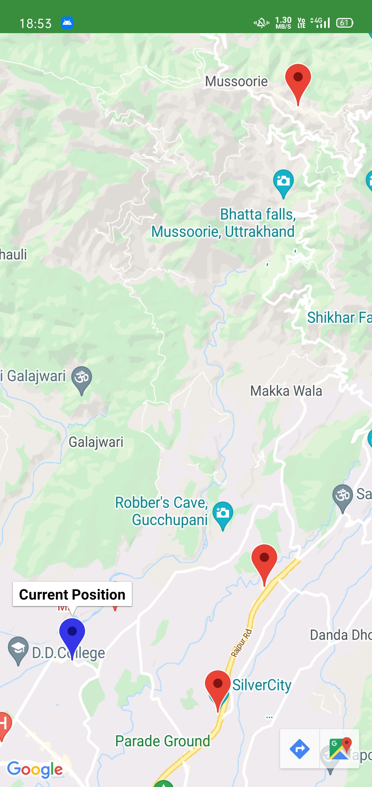

**Smart City Traveler**
====================

### **About Project**

*	Smart City Traveler is an Android Application, that recommends places and venues that can be visited by a user travelling a city. The user will be given 2 options in the starting, for location tracking. If the user wants their location to be tracked automatically, they can press the "Detect My Location" button, else they can press the enter location manually and enter the location where they want to find the venues. 
	 

*	As soon as one of these buttons are pressed, the geographical coordinates of the place are extracted and the user is directed to the next screen. Here, the user has to select their interests, i.e., what type of venue the user wants to visit. It should be noted that at max 3 and at min 1 interest should be selected at a time. The range in which venues are selected can also be changed by the seek-bar provided at the right side (10km default). 
	 

*	When the interests are selected, the places/venues are shown one by one in the form of a list, implemented with a Recycler View. Each list contains the places that the user can select by clicking on it. When the first interest is selected, then the next list of venues is shown and the user has to select from that list and so on.When the final venue is selected, all the venues are shown on the Google Maps, along with the current position and the user can travel to any venue. 
	
	
	 

*	This is the final screen. This screen shows the google map, which includes current position and all the venues that were selected. The blue blip denotes current position, the red blips denote the destinations, in the form they were selected. The indexes of the locations can be seen when the blips are pressed. 
	
	 

### **Tools Used:-**

*	_Android Studio_ is the official IDE for android development. Our application was also built on the Android Studio IDE.

*	_Java_ is a very powerful OOP language, which is used for the backend development of our application.
    
*	_XML_ is also called as the Extensible Markup Language, which has been used in our application for frontend development.

### **APIs Used:-**

*	_Foursquare API:_ Provides location-based experiences with diverse information about venues, users, photos, and check-ins. The API supports real time access to places, Snap-to-Place that assigns users to specific locations, and Geo-tag. Additionally, foursquare allows developers to build audience segments for analysis and measurement. JSON is the preferred response format. 
A simple call to the api can be made by: https://api.foursquare.com/v3/places/search?ll=[xxlat,xxlng]&llacc=100&sortByPopularity=true&radius=[x_meters]&query=[any_venue]. The next step to make a call is to pass your Foursquare API key as a header to the call. In Java, it can be done by using the setRequestProperty(p1, p2) method of the HttpUrlConnection class. 'p1' is a String telling which type of property, value is "Authorization" and 'p2' is also a String, denoting your API key -> obj.setRequestProperty("Authorization", "xxx_api_key");

*	_Geocode API:_ Geocoding is the process of converting addresses (like a street address) into geographic coordinates (like latitude and longitude), which you can use to place markers on a map, or position the map. Reverse Geocoding is the complete opposite of Geocoding. Reverse Geocoding converts the coordinates into a Street/Location address. 
A simple call(address->coordinates) to the api can be made by: https://app.geocodeapi.io/api/v1/search?apikey=[api_key]&text=[xxx_address].

*	_GoogleMaps API:_ Used to display the google map into the view. This API is not explicitly used. It is used internally by the GoogleMaps Activity. The API automatically handles access to Google Maps servers, data downloading, map display, and response to map gestures. You can also use API calls to add markers, polygons, and overlays to a basic map. No need to call this API explicitly.

### **Project Requirements:-**

*	_Language:_ Java and XML
*	_Gradle Version:_ 7.2
*	_Gradle Plugin Version:_ 7.1.1
*	_Gradle JDK Version:_ 11.0.11
*	_Compile SDK Version:_ API-31 (Android 12.0 (S))

### **Note:-**

*   To make use of FusedLocationProvider client for automatic detection of location, add the google play dependency to build.gradle file. Add this line to dependencies {...} section: implementation 'com.google.android.gms:play-services-location:19.0.1'

*   If you want to run this project, create API keys on - Foursquare, GeocodeApi and GoogleMaps and then create an xml file by the name - "google_maps_api.xml". Enter all the new API keys in this file as string resources. Make sure to use keys as: "google_maps_key", "geocodeApiKey" and "foursquareApiKey1" as the keys and their respective values in the normal form.

*   Note that gradle and other dependencies will be updated as time goes by.
